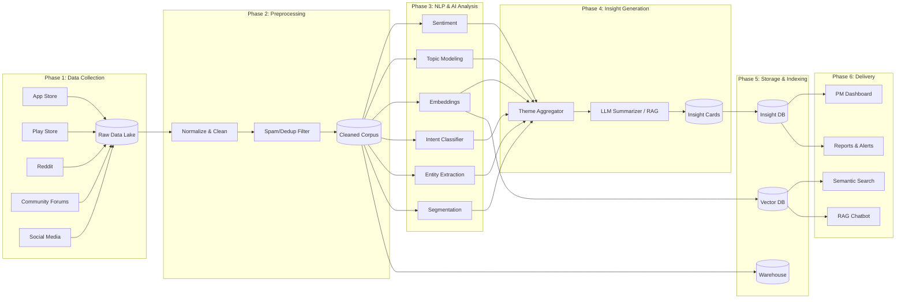

# Phase-Wise Architecture

## AI-Powered Review Discovery Engine for Spotify

This document outlines the end-to-end architecture of the Review Discovery Engine, broken down into **six logical phases**. Each phase has clear inputs, outputs, components, tools, and responsibilities — so the system can be built, tested, and scaled incrementally.

---

## High-Level Architecture Overview

```
                                  ┌────────────────────────────────────┐
                                  │   AI-Powered Review Discovery      │
                                  │           Engine (Spotify)         │
                                  └────────────────────────────────────┘
                                                  │
   ┌──────────────┐   ┌──────────────┐   ┌──────────────┐   ┌──────────────┐   ┌──────────────┐   ┌──────────────┐
   │  Phase 1     │──▶│  Phase 2     │──▶│  Phase 3     │──▶│  Phase 4     │──▶│  Phase 5     │──▶│  Phase 6     │
   │  Data        │   │  Data        │   │  NLP &       │   │  Insight     │   │  Storage &   │   │  Visualization│
   │  Collection  │   │  Preprocess  │   │  AI Analysis │   │  Generation  │   │  Indexing    │   │  & Delivery  │
   └──────────────┘   └──────────────┘   └──────────────┘   └──────────────┘   └──────────────┘   └──────────────┘
        Raw                Clean              Enriched           Structured         Queryable          Dashboard /
       reviews             text              reviews +           insights           insight DB          PM-facing
                                             metadata                                                   reports
```

---

## Phase 1 — Data Collection (Ingestion Layer)

**Goal:** Continuously collect raw user feedback from multiple public platforms.

### Inputs
- Source URLs and API endpoints (App Store, Play Store, Reddit, Spotify Community, Social Media)
- Scraping/API configuration (rate limits, date ranges, keywords)

### Components
| Component | Responsibility |
|---|---|
| **App Store Connector** | Pull iOS reviews via `app-store-scraper` / RSS feeds |
| **Play Store Connector** | Pull Android reviews via `google-play-scraper` |
| **Reddit Connector** | Fetch posts & comments via PRAW (Reddit API) |
| **Community Forum Scraper** | Crawl Spotify Community threads |
| **Social Media Connector** | Fetch public posts from X/Twitter, etc. |
| **Scheduler** | Cron/Airflow jobs for incremental fetches |
| **Raw Data Lake** | Store raw JSON dumps (S3 / local FS / MinIO) |

### Tech Stack
- **Languages:** Python
- **Libraries:** `requests`, `praw`, `google-play-scraper`, `app-store-scraper`, `tweepy`, `BeautifulSoup`
- **Orchestration:** Apache Airflow / Prefect / cron
- **Storage:** AWS S3, MinIO, or local filesystem (Parquet/JSON)

### Output
- Raw, source-tagged review records: `{source, review_id, text, rating, date, user_meta, lang}`

---

## Phase 2 — Data Preprocessing & Cleaning

**Goal:** Convert noisy multi-source data into a clean, standardized corpus ready for NLP.

### Inputs
- Raw review records from Phase 1

### Components
| Component | Responsibility |
|---|---|
| **Schema Normalizer** | Map every source into a unified schema |
| **Language Detector** | Filter / tag language (`langdetect`, `fastText`) |
| **Translator (optional)** | Translate non-English reviews via NMT model |
| **Spam & Duplicate Filter** | Remove bots, duplicates, near-duplicates (MinHash / SimHash) |
| **Text Cleaner** | Remove emojis, URLs, HTML, normalize unicode |
| **PII Redactor** | Strip emails, usernames, phone numbers |
| **Quality Scorer** | Drop reviews that are too short / low-signal |

### Tech Stack
- `pandas`, `spaCy`, `langdetect`, `ftfy`, `datasketch` (MinHash)
- Hugging Face translation models (e.g., `Helsinki-NLP/opus-mt-*`)

### Output
- Cleaned, deduplicated, normalized dataset stored as Parquet:
  `{review_id, source, clean_text, lang, rating, timestamp, user_segment_hint}`

---

## Phase 3 — NLP & AI Analysis (Core Intelligence Layer)

**Goal:** Apply AI/NLP to extract structured signal from each review.

### Sub-Modules

#### 3.1 Sentiment Analysis
- Classify each review as Positive / Negative / Neutral
- Optionally provide aspect-based sentiment (e.g., *Discover Weekly = negative*, *audio quality = positive*)
- Models: `cardiffnlp/twitter-roberta-base-sentiment`, VADER for fast baseline

#### 3.2 Topic Modeling & Theme Extraction
- Discover recurring topics across thousands of reviews
- Techniques: **BERTopic**, LDA, or embedding clustering (HDBSCAN)
- Output: Topic IDs + representative keywords + example reviews

#### 3.3 Embedding Generation
- Convert each review to a dense vector for semantic search & clustering
- Models: `sentence-transformers/all-MiniLM-L6-v2` or OpenAI `text-embedding-3-small`

#### 3.4 Intent Classification
- Tag user goals: *find new artists, workout playlist, study music, mood discovery, social listening...*
- Zero-shot via LLM (`facebook/bart-large-mnli`) or fine-tuned classifier

#### 3.5 Named Entity Recognition (NER)
- Extract artist names, song names, playlists, features (e.g., "Discover Weekly", "Daylist")
- spaCy + custom entity ruler for Spotify-specific terms

#### 3.6 User Segmentation Signals
- Heuristic + LLM-based tagging: new user / long-term / free / premium / casual / heavy / genre-specific
- Derived from review text cues ("I've been using Spotify for 5 years…")

### Tech Stack
- **LLM provider:** [**Groq**](https://groq.com) (`llama-3.3-70b-versatile`) — chosen for speed (~10× faster than OpenAI for the same class of model), JSON-mode output, and generous free tier.
- **Why Groq:** running thousands of reviews through an LLM needs fast, cheap inference. Groq's LPU hardware delivers Llama-3.3-70B output in ~1 s per call, enabling per-review structured extraction at scale without batching tricks.
- **Auxiliary models:** Hugging Face Transformers, BERTopic, spaCy for clustering / embeddings / NER.
- **Compute:** No GPU needed locally — Groq does the heavy lifting via API.

### Output
- Enriched review records with **sentiment, discovery-relevance flag, pain category, user segment, unmet need, and a verbatim quote** — extracted in a single LLM call per batch of 10 reviews.

---

## Phase 4 — Insight Generation (Synthesis Layer)

**Goal:** Aggregate per-review signals into **product-level insights** that PMs can act on.

### Components
| Component | Responsibility |
|---|---|
| **Theme Aggregator** | Group clusters into named pain-point themes (e.g., "Repetitive recommendations") |
| **Pain Point Summarizer** | Use LLM to summarize each cluster into a 2–3 sentence narrative |
| **Unmet Needs Extractor** | LLM prompt: "Extract feature requests / missing capabilities" |
| **Trend Detector** | Time-series analysis to find emerging vs. declining topics |
| **Segment Comparator** | Compare pain points across user segments (e.g., Free vs. Premium) |
| **Evidence Linker** | Attach representative review quotes to every insight (for credibility) |
| **Priority Scorer** | Rank insights by volume × sentiment severity × recency |

### LLM Prompting Strategy
- Retrieval-Augmented Generation (RAG): pull top-N reviews per cluster → feed to **Groq (Llama 3.3 70B)** → generate insight card
- Output JSON-schema enforced via Groq's `response_format={"type": "json_object"}` (strict JSON mode)
- Same provider (Groq) is reused from Phase 3 — no second vendor needed

### Output
- Structured **Insight Cards**:
```json
{
  "insight_id": "INS-001",
  "title": "Users feel Discover Weekly recycles familiar artists",
  "theme": "Recommendation Quality",
  "severity": "High",
  "affected_segments": ["Long-term users", "Heavy listeners"],
  "evidence_quotes": ["...", "..."],
  "supporting_review_count": 847,
  "trend": "increasing",
  "suggested_opportunity": "Introduce 'novelty slider' in personalized playlists"
}
```

---

## Phase 5 — Storage & Indexing Layer

**Goal:** Make all raw data, enriched reviews, and final insights queryable and searchable.

### Components
| Store | Purpose | Tech |
|---|---|---|
| **Raw Data Lake** | Source-of-truth raw reviews | S3 / MinIO (Parquet) |
| **Processed Warehouse** | Cleaned + enriched reviews | DuckDB / Postgres / BigQuery |
| **Vector Database** | Semantic search across reviews | Pinecone / Weaviate / Chroma / pgvector |
| **Insight Database** | Structured insight cards | PostgreSQL (JSONB) |
| **Metadata Catalog** | Track sources, runs, model versions | SQLite / Postgres |

### Capabilities Enabled
- Semantic search: *"Show me all reviews about workout playlist discovery"*
- Filter by source, sentiment, segment, time range
- Re-run analysis with new models on historical data
- Audit trail (which model version produced which insight)

---

## Phase 6 — Visualization & Delivery (PM-Facing Layer)

**Goal:** Deliver insights in a format Product Managers can actually use.

### Components
| Component | Responsibility |
|---|---|
| **Insight Dashboard** | Interactive UI showing top pain points, themes, trends |
| **Segment Explorer** | Compare insights across user segments |
| **Topic Trend Charts** | Time-series view of emerging issues |
| **Review Search UI** | Semantic search + filters across all reviews |
| **Insight Report Generator** | One-click export to PDF / Notion / Confluence |
| **Chatbot (optional)** | "Ask the Reviews" RAG chatbot for PMs |
| **Alerting** | Slack/email alerts when new high-severity themes emerge |

### Tech Stack
- **Frontend:** Streamlit, Next.js, or Dash (for fast iteration)
- **Charts:** Plotly, Recharts
- **RAG Chatbot:** LangChain + vector DB + LLM
- **Notifications:** Slack API, SendGrid

### Output
- Live dashboard
- Weekly insight digests
- Exportable PM-ready reports

---

## Cross-Cutting Concerns

These apply across **all phases**:

| Concern | Approach |
|---|---|
| **Orchestration** | Airflow / Prefect DAGs running each phase end-to-end |
| **Configuration** | YAML/`.env` driven — sources, models, thresholds |
| **Logging & Monitoring** | Structured logs (loguru), metrics (Prometheus + Grafana) |
| **Model Versioning** | MLflow / DVC to track model + data versions |
| **Cost Control** | Cache LLM calls, batch embedding requests, use smaller models where possible |
| **Privacy & Compliance** | PII redaction in Phase 2; respect platform ToS for scraping |
| **Evaluation** | Human-in-the-loop sampling to validate themes, sentiment, and insights |
| **Reproducibility** | Containerized (Docker), deterministic seeds, snapshotted datasets |

---

## Suggested Build Order (MVP → Production)

| Iteration | Scope |
|---|---|
| **MVP (Week 1–2)** | Phase 1 (1 source: Play Store) → Phase 2 → basic Phase 3 (sentiment + BERTopic) → Streamlit dashboard |
| **V1 (Week 3–4)** | Add App Store + Reddit, full Phase 3 (intent, NER, embeddings), Phase 5 vector DB |
| **V2 (Week 5–6)** | Full Phase 4 with LLM insight cards, segment comparison, trend detection |
| **V3 (Week 7+)** | Forums + social, RAG chatbot, alerting, scheduled refreshes, model evaluation harness |

---

## Architecture Diagram (Mermaid)



---

## Summary

This six-phase architecture turns **noisy public feedback** into **structured, evidence-backed product insights**:

1. **Collect** raw reviews from many sources
2. **Clean** them into a unified corpus
3. **Analyze** with NLP + LLMs to extract structured signals
4. **Synthesize** signals into PM-ready insight cards
5. **Store & Index** everything for search and reproducibility
6. **Deliver** insights via dashboards, reports, and chatbots

Each phase is **independently buildable**, **independently testable**, and **independently swappable** — allowing the team to start small (MVP with one data source) and scale up to a full, multi-source, continuously-updating Review Discovery Engine.
